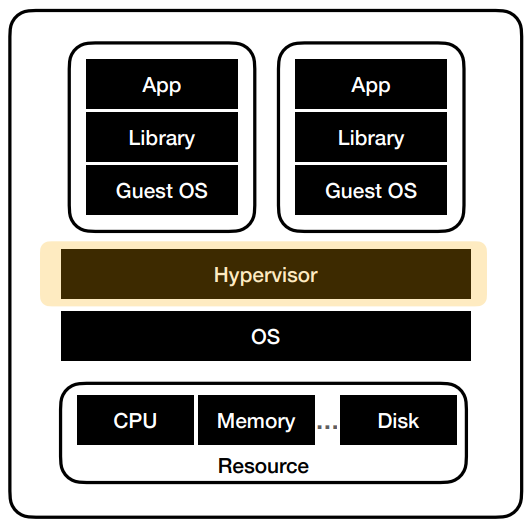
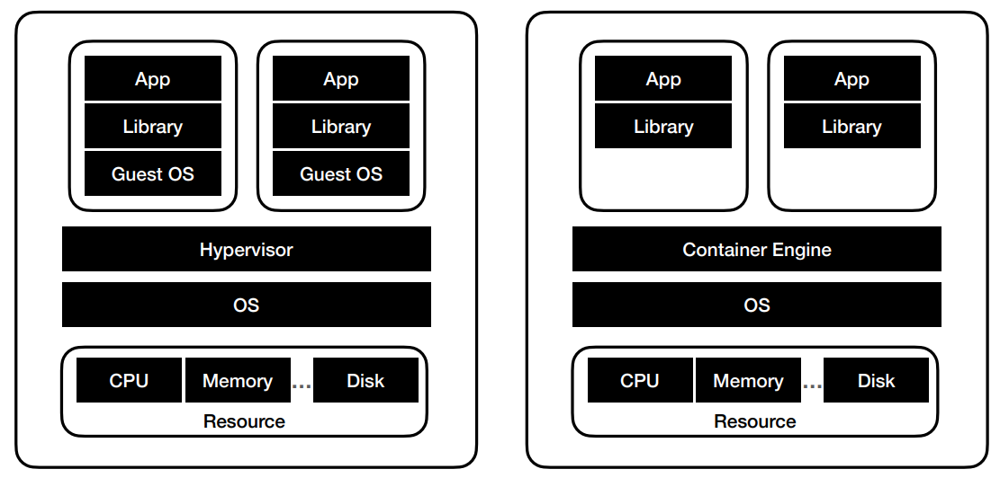
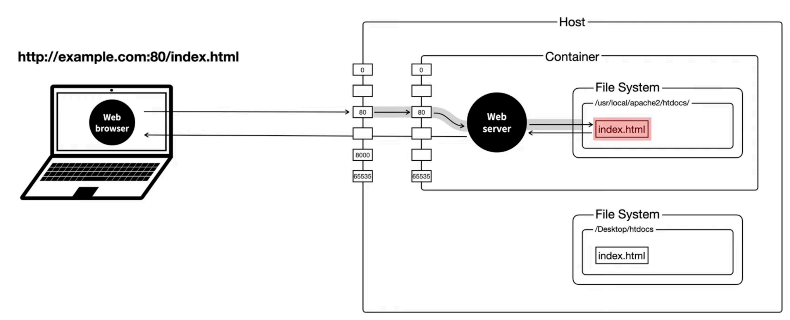
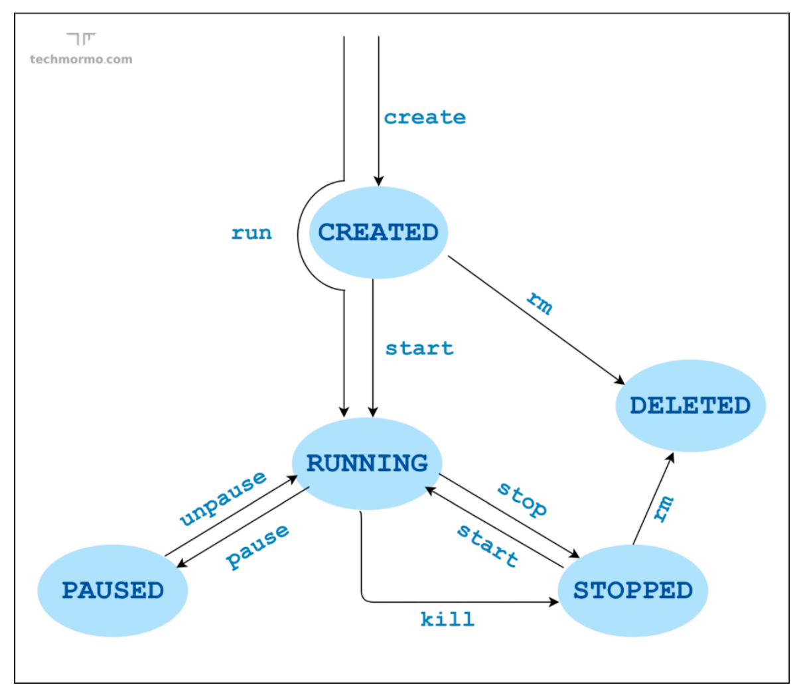
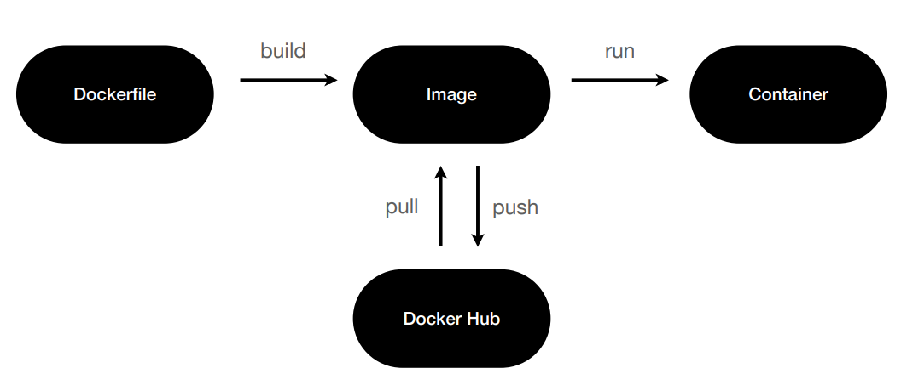
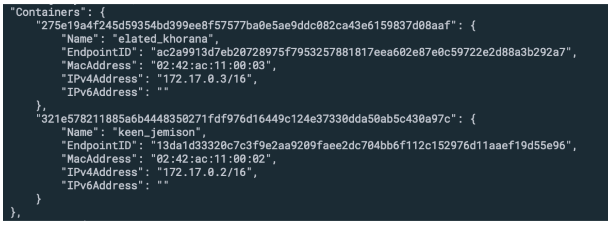
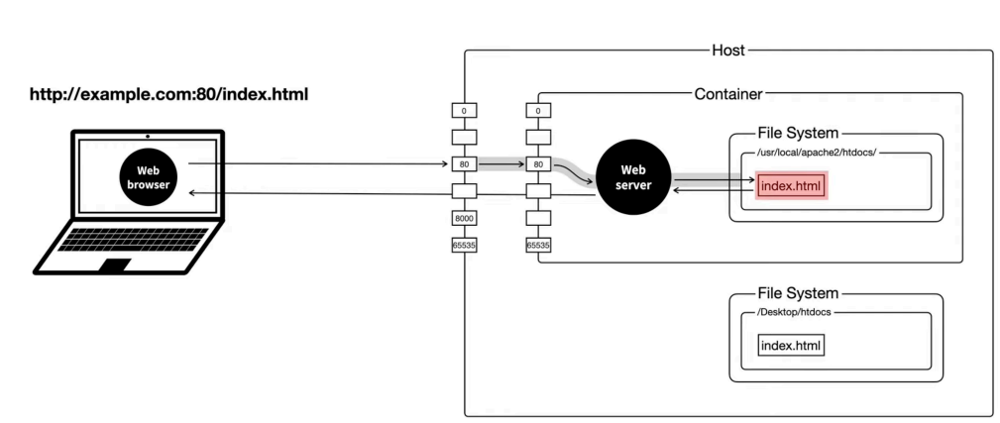
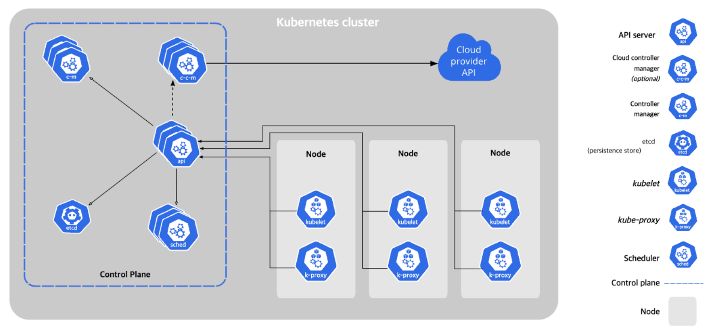

### Docker란?
- 컨테이너 기반 가상화 도구
- 애플리케이션을 컨테이너라는 단위로 격리하여, 실행하고 배포하는 기술

<br>

### Container란?
- 컨테이너 : 가상화 기술 중 하나
- 호스트 운영체제 위에, 여러 개의 격리된 환경을 생성
- 각각의 컨테이너 안에서 애플리케이션을 실행

<br>

### 가상화(Virtualization) 기술이란?
- 하나의 물리적인 컴퓨터 자원(CPU, 메모리, 저장장치 등)을 가상적으로 분할하여 여러 개의 가상 컴퓨터 환경을 만들어 내는 기술
- 이를 통해 물리적인 컴퓨터 자원을 더욱 **효율적**으로 사용 가능
- 서버나 애플리케이션 등을 운영하는데 있어 **유연성**과 **안정성** 제공

#### **하이퍼바이저** (Hypervisor) 란?
- 가상 머신(Virtual Machine, VM)을 생성하고 구동하는 소프트웨어
- OS에 자원을 할당 및 조율
- OS들의 요청을 번역하여 하드웨어에 전달
<br>


<br>

### Virtual Machine VS Container


<br>

### 컨테이너 기반 특징
- 리눅스 커널의 기능을 사용하여 만들어짐
    - chroot: 파일 시스템을 격리
    - namespace : 프로세스 격리
    - cgroup : 하드웨어 자원 격리
- 프로세스 단위의 격리 환경

<br>

### Docker 란 무엇일까?
- 컨테이너 기반 가상화 도구
    - 리눅스 컨테이너 기술인 LXC(Linux Containers) 기반
- 애플리케이션을 컨테이너라는 단위로 격리하여 실행하고 배포하는 기술
- 다양한 운영체제에서 사용 가능
- 컨테이너화된 애플리케이션을 손쉽게 빌드, 배포, 관리할 수 있는 다양한 기능을 제공
- 위 기능들을 통해 애플리케이션을 빠르게 개발하고, 효율적으로 배포/관리 가능

### Docker Architecture
#### **도커 데몬(Docker daemon = dockerd)**
- 도커 엔진의 핵심 구성 요소
- 도커 호스트에서 컨테이너를 관리하고 실행하는 역할
- 컨테이너를 생성, 시작, 중지, 삭제하는 등의 작업을 수행
- 컨테이너 이미지를 관리하고
- 외부에서 이미지를 다운로드하고 빌드하는 작업을 수행

<br>

#### **도커 클라이언트(Docker Client)**
- Docker와 상호 작용
- docker 명령어를 사용하면 Docker daemon으로 보내어 실행

<br>

#### **도커 오브젝트(Docker Object)**
- 도커 이미지 (Docker Image)
    - 도커 컨테이너를 만들기 위한 읽기 전용 템플릿
- 도커 컨테이너 (Docker Container)
    - 한 도커 이미지의 실행 가능한 인스턴스
    - 애플리케이션을 실행하기 위한 모든 파일과 설정 정보를 포함하는 패키지
- 도커 레지스트리(Docker Registries)
    - 도커 이미지 (Docker Image)를 관리하고 저장하는 곳
    - Docker hub: 디폴트 레지스트리, 누구나 접근 가능한 공개형 저장소


### Docker CLI
- Download an image from a registry
    
    `docker pull [OPTIONS] NAME[:TAG|@DIGEST]`

- List images

    `docker images [OPTIONS] [REPOSITORY[:TAG]]`

- Create and run a new container from an image

    `Stop one or more running containers`

- Stop one or more running containers

    `docker stop [OPTIONS] CONTAINER [CONTAINER...]`

- Fetch the logs of a container

    `docker logs [OPTIONS] CONTAINER`

- Remove one or more containers

    `docker rm [OPTIONS] CONTAINER [CONTAINER]`

- Remove one or more images

    `docker rmi [OPTIONS] IMAGE [IMAGE...]`

<br>

### Docker Network


<br>

### The Container Lifecycle


<br>

### Dockerfile



### 2-1. 도커 이미지 빌드하기

#### 도커 파일이란?
- 도커 컨테이너를 빌드하고 설정하는 데 사용되는 텍스트 파일
- 도커 이미지를 어떻게 구성할지를 정의하는 파일
- 도커 이미지를 만들기 위한 명령어와 설정 정보를 담고 있음
    - 베이스 이미지
    - 빌드시 실행할 명령어
    - 복사할 파일
    - 환경 변수

#### Dockerfile Syntax
- **FROM** : 베이스 이미지 선정
    - 반드시 있어야 하는 명령어
    - 여러 겹의 이미지를 쌓아 가는데, 그 층 중 가장 기본이 되는 이미지
- **WORKDIR** : work directory 선정
    - 도커파일 뒤에 오는 모든 지시자(RUN, CMD, COPY, ADD 등)에 대한 작업 디렉토리를 선정
    - 리눅스 명령어의 cd와 비슷한 역할
- **COPY** : 복사할 파일 선정 (예: 작업한 서비스 파일들)
    - 현재 로컬 컴퓨터에 있는 파일을 도커 컨테이너 안으로 복사하는 기능
- **RUN** : (이미지 빌드 시) 실행할 명령어
- **CMD** : (컨테이너 생성 시) 실행할 명령어
    - CMD 명령어는 RUN 명령어가 이미지를 빌드할 때 실행되는 것과 달리, 이미지로부터 컨테이너를 생성해 최초로 실행 시 수행됨
- **ENTRYPOINT** : (컨테이너가 생성되고 최초로) 실행할 명령어 (예: 서버 실행)
    - 현재 로컬 컴퓨터에 있는 파일을 컨테이너 안으로 복사하는 기능

#### Layers in image
- Dockerfile을 빌드하여 Docker 이미지를 생성하면 Dockerfile의 명령별로 이미지를 생성
- 작성된 여러 개의 이미지는 레이어 구조로 되어 있음
```
FROM golang:1.20 - alpine
WORKDIR /src
COPY . .
RUN go mod download
RUN go build -o /bin/client ./cmd/client
RUN go build -o /bin/server ./cmd/server
ENTRYPOINT [ "/bin/server" ]
```

### 2-2. 도커 이미지를 도커 허브에 올리기

#### 도커 이미지 만들기
- 이미지 태그 설정
    - Docker Hub에 이미지를 등록하려면 아래와 같은 규칙을 준수해야 함
    - [Docker Hub 사용자명]/이미지명:[태그명]
- 태그 방법
    - build 시: docker build -t my-httpd .
    - build 후: docker image tag [image name]

<br>

#### 도커 허브에 로그인하기
- Log in to a registry <br>
    `docker login [OPTIONS] [SERVER]`
- Log out from a registry <br>
    `docker logout [SERVER]`

#### 도커 이미지 올리기
- Upload an image to a registry <br>
    `docker push [OPTIONS] NAME[:TAG]`
<br>

### 2-3. 도커 네트워크

#### 네트워크 드라이버
- `docker network ls` <br>
- Network Drivers
    - bridge : 기본 네트워크 드라이버, 동일한 도커 호스트에서 컨테이너 간의 통신을 도와줌
    - host : 호스트의 네트워크를 직접 사용
    - overlay : 서로 다른 도커 호스트의 컨테이너 간 통신을 도와줌

- docker network inspect bridge


<br>

#### Port Forwarding, Volume Mount

<br>

`docker run -p 8888:80 -v ~/Desktop/htdocs:/usr/local/apache2/htdocs/ httpd`

<br>

### 도커 컴포즈

#### 도커 컴포즈란?
- 도커 컨테이너를 일괄적으로 정의하고 제어하는 도구
- 설정 파일을 도커 CLI로 번역하는 역할
- [예제](https://github.com/drum-grammer/docker-pro-2308/blob/main/lecture/2nd/local-infra.yml)

#### 도커 컴포즈 파일 구성
컴포즈 파일은 아래의 것들을 정의한 YAML 파일
- Version (Optional)
    - [참고 링크](https://docs.docker.com/compose/compose-file/compose-versioning)
- Services (Required)
    - ports: 개방할 포트 지정, docker run 명령어의 -p와 동일
    - expose: 링크로 연계된 컨테이너에게만 공개할 포트 설정
    - volumes: 컨테이너에 볼륨을 마운트함
    - restart: 컨테이너가 종료될 때 재시작 정책
        - no: 재시작되지 않음
        - always: 외부에 영향에 의해 종료 되었을 때 항상 재시작(수동으로 끄기 전까지)
        - on-failure: 오류가 있을 시에 재시작
- Networks
- Volumes
- Configs
- Secrets

<br>

#### 도커 컴포즈 명령어
- docker-compose vs docker compose
    - docker-compose 명령어가 docker compose로 흡수됨
    - Docker 1.13 이후로 docker-compose 명령어가 Docker CLI에 통합됨
    (이전에는 docker-compose 명령어가 별도로 설치되어야 했음)

- `docker-compose -f local-infra.yml up -d`
    - up: 도커 컴포즈 파일로, 컨테이너를 생성하기
    - -f: 도커 컴포즈 파일 지정하기
    - -d: 백그라운드에서 실행하기

#### 도커 CLI로 여러개 컨테이너 관리하기

##### 도커 네트워크 리스트 조회
`docker network ls`
- bridge: 도커 엔진에 의해 자동으로 생성되는 가상 네트워크. 컨테이너끼리 연결되는 기본 네트워크
- host: 호스트 컴퓨터의 네트워크 인터페이스를 그대로 사용하는 네트워크
- none: 네트워크를 사용하지 않는 컨테이너

##### 도커 네트워크 생성
`docker network create wordpress_net`

##### mysql db container 생성
```
docker \
run \
--name "db" \
-v "$(pwd)/db_data:/var/lib/mysql" \
-e "MYSQL_ROOT_PASSWORD=root_pass" \
-e "MYSQL_DATABASE=wordpress" \
-e "MYSQL_USER=docker_pro" \
-e "MYSQL_PASSWORD=docker_pro_pass" \
--network wordpress_net \
mysql:latest
```

##### wordpress container 생성
```
docker \
run \
--name app \
-v "$(pwd)/app_data:/var/www/html" \
-e "WORDPRESS_DB_HOST=db" \
-e "WORDPRESS_DB_NAME=wordpress" \
-e "WORDPRESS_DB_USER=docker_pro" \
-e "WORDPRESS_DB_PASSWORD=docker_pro_pass" \
-e "WORDPRESS_DEBUG=1" \
-p 8000:80 \
--network wordpress_net \
wordpress:latest
```

##### docker-compose.yml
```
version: "3.0"
services:
db:
image: mysql:latest
volumes:
- ./db_data:/var/lib/mysql
restart: always
environment:
MYSQL_ROOT_PASSWORD: root_pass
MYSQL_DATABASE: wordpress
MYSQL_USER: docker_pro
MYSQL_PASSWORD: docker_pro_pass
app:
depends_on:
- db
image: wordpress:latest
volumes:
- ./app_data:/var/www/html
ports:
- "8000:80"
restart: always
environment:
WORDPRESS_DB_HOST: db:3306
WORDPRESS_DB_NAME: wordpress
WORDPRESS_DB_USER: docker_pro
WORDPRESS_DB_PASSWORD: docker_pro_pass
```

`docker compose -f docker-compose.yml up --build`

<br>


### 컨테이너 오케스트레이션 툴

- GCP
    - GKE (Google Kubernetes Engine)
- AWS
    - EKS (Elastic Kubernetes Service)
    - ECS (Elastic Container Service)

#### 컨테이너 오케스트레이션의 기능

- 컨테이너 클러스터링(Clustering):
    - 여러 대의 노드(node)를 하나의 클러스터(cluster)로 묶어 애플리케이션을 분산하여 실행하고, 자원을 효율적으로 활용하는 기능

    - 여러 대의 물리적인 또는 가상의 서버를 하나의 시스템처럼 동작하게 하는 기술

    - 컨테이너를 실행하는 호스트의 자원을 효율적으로 분배, 컨테이너가 안정적으로 실행되도록 함

    - 여러 대의 컨테이너를 묶어 하나의 서버처럼 사용할 수 있도록 지원

- 서비스 디스커버리(Service Discovery):
    - 컨테이너를 자동으로 발견하고, 서비스 이름과 IP 주소 등을 관리하여, 애플리케이션 간의 연결을 관리하는 기능

    - 클라우드 환경에서의 컨테이너 생성, 배치, 이동에 따른 IP, Port 정보 업데이트 및 관리

- 자동 스케일링(Autoscaling):
    - 애플리케이션의 트래픽 양에 따라 자동으로 컨테이너 수를 조절하여, 자원 사용량을 최적화하고, 가용성을 보장하는 기능

- 로드 밸런싱(Load Balancing):
    - 여러 대의 노드에서 실행 중인 컨테이너들을 조절하여, 트래픽을 균등하게 분배하여, 애플리케이션의 성능을 최적화하는 기능

- 롤아웃과 롤백(Rollout and Rollback):
    - 새로운 버전의 애플리케이션을 롤아웃하고, 이전 버전으로 롤백하는 기능

- 자동 복구(Automatic Recovery):
    - 컨테이너나 노드의 장애 시 자동으로 복구하는 기능

- 모니터링과 로깅(Monitoring and Logging):
    - 컨테이너나 노드의 상태를 모니터링하고, 로그를 수집하여, 애플리케이션의 성능과 문제점을 분석하는 기능

- 보안과 네트워크 관리(Security and Network Management):
    - 컨테이너와 노드의 보안을 관리하고, 네트워크 설정을 관리하는 기능


#### 대표적인 컨테이너 오케스트레이션
- [datadog report for cloud](https://info.flexera.com/CM-REPORT-State-of-the-Cloud-2023-Thanks) (2021)

- [PALARK 분석 보고서](https://blog.palark.com/kubernetes-and-containers-market-trends-2021/)

#### 대표적인 컨테이너 오케스트레이션 툴/서비스
1. 도커 스웜
- Docker Inc.이 개발한 도커 컨테이너 오케스트레이션 도구
- Docker Swarm은 2015년 Docker 1.12 버전에서 처음 발표됨
- Docker Swarm Classic이라는 이름으로 Swarm 모드가 추가되기 전, 도커 엔진에 통합되기 전에 독립적으로 배포
- Docker Swarm은 쿠버네티스가 등장하기 전까지 가장 대중적인 컨테이너 오케스트레이션 도구 중 하나
- 간단히 작동하고, 설정이 쉬움

<br>

2. Kubernetes(K8s)
- 배경
    - Gmail, Youtube, 검색 등 다양한 웹 서비스가 있고, 대용량 트래픽을 감당해야 함
    - 이를 감당하기 위해, Kubernetes 프로젝트를 시작, 실제 서비스에 적용
- 오픈소스 기반
- 구글에서 설계, 현재 리눅스 재단에 의해 관리
- 쿠버네티스 v1.0은 2015년 7월 21일에 출시됨
- 대규모에 적합
    - 스케일링 기능 강화 (Replication Controller: 컨테이너 수를 동적으로 조절)
    - 서비스 디스커버리 기능 강화 (DNS 기반)
- 가장 기능이 풍부하고, 널리 사용되는 컨테이너 오케스트레이션 프레임워크
- 베어 메탈, VM환경, 퍼블릭 클라우드 등의 다양한 환경에서 작동하도록 설계됨
- [공식 문서](https://kubernetes.io/ko/docs/home/)
- 쿠버네티스 컴포넌트 <br>


3. GKE (Google Kubernetes Engine)
- Google Cloud Platform(GCP)에서 제공하는 Kubernetes 기반의 관리형 컨테이너 오케스트레이션 서비스
- GKE는 K8s를 기반으로 하고, K8s의 기능을 모두 제공

4. EKS (Amazon Elastic Kubernetes Service)
- AWS에서 제공하는 관리형 K8s 서비스
- EKS는 K8s 기반으로 구축되어 있음
- 사용자는 K8s API를 사용해 EKS 클러스터를 관리 가능

5. ECS (Amazon Elastic Container Service)
- AWS에서 제공하는 관리형 컨테이너 오케스트레이션 서비스
- Docker 컨테이너를 실행하기 위한 기능을 제공
- 사용자는 ECS를 사용해 컨테이너를 배포, 관리, 스케일링

