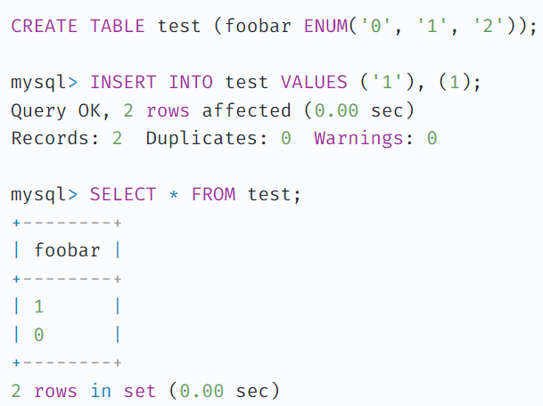
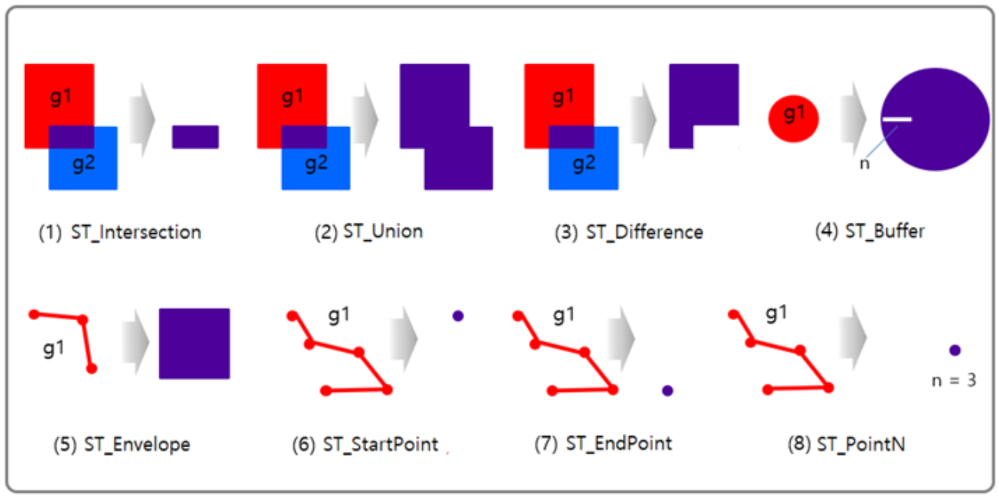

### 목차

### Timestamp vs Datetime
Timestamp
- UTC 기준 저장
    - mysql time_zone이 바뀌면 값이 바뀜
    - 글로벌 서비스를 할 경우, Timestamp를 사용하는 것이 더 좋음
- 1970-01-01 00:00:01부터 2038-01-19 03:14:07까지 지원

Datetime
- mysql time_zone이 바뀌어도 값이 바뀌지 않음
- 1000-01-01 00:00:00부터 9999-12-31 23:59:59까지 지원

##### 참고 자료
- [MySQL Timestamp와 Datetime의 차이](https://abbo.tistory.com/208)

 

### MySQL ENUM
- 여러 값 중 허용된 값만 저장되게끔 제약함

**단점**
1. 정규화를 위반하는 데이터 설계
- 모델 생성과 관련된 데이터만 담아야할 곳에, 레코드와 관련된 데이터를 담음  
-> DB 정규화 위반

2. ENUM 칼럼은 데이터 수정이 어려움
- ENUM 대상 값을 변경할 때 기존의 값이 더 이상 포함되지 않는다면, MySQL이 ""(빈 스트링)으로 변환함 (strict mode를 사용한다면 예방 가능)  
-> 참조 테이블을 사용하면, 이름을 바꾸거나 대상을 제거할 때 더 유연히 대처 가능

3. ENUM 칼럼은 속성을 추가하거나 연관된 정보를 저장할 수 없음
- 참조 테이블을 사용하면, 확장성 덕에 많은 경우 유연히 대처 가능

4. 유일한 ENUM 값들만 조회하는 것이 어려움
- 아직까지 순수 SQL만으로 ENUM 칼럼의 대상 값을 가져오는 방법이 없음 (ORM을 사용할 경우에는 크게 문제되지 않음)

5. ENUM을 사용함으로써 얻는 최적화의 효과가 그리 크지 않을 수 있음

6. ENUM 칼럼에 정의된 값들은 다른 테이블에서 재사용 불가
- ENUM 칼럼을 사용할 때는 서로 다른 두 테이블에 동일한 값을 복사하는 것 말고는 방법이 없음

7. 특성상 조심해서 사용해야 함
- strict mode를 사용하지 않을 경우, 기존 ENUM에 새 값을 추가하면 새로운 값은 ""(빈 스트링)으로 들어감
- MySQL은 ENUM 값을 내부적으로 정수 키로 참조하기 때문에, 값이 아닌 인덱스를 참조하게 되는 일도 흔히 발생함  
ex)  

8. 다른 DBMS에서 널리 통용되지 않음
- ENUM 타입은 표준 SQL 문법에 포함되지 않음
- MySQL을 제외하면 ENUM을 지원하는 DBMS는 많지 않음  
-> 어떤 이가 DB를 이전하고자한다면, ENUM을 변환하는 추가적인 과정이 필요하게 됨

 

**ENUM을 사용해도 괜찮은 상황**
1. 유일하고 변하지 않는 값을 저장할 경우
2. 절대로 연관된 정보를 저장할 필요가 없는 경우
3. 두 개 초과 20개 이하의 값을 다룰 경우

 

##### 참고 자료
- [MySQL의 ENUM 타입을 사용하지 말아야 할 8가지 이유](https://velog.io/@leejh3224/번역-MySQL의-ENUM-타입을-사용하지-말아야-할-8가지-이유)

### 공간 DB
- 공간 Data Type
    : X, Y 좌표로 구성된 공간 데이터를 저장, 연산할 수 있는 기능을 제공해주는 DB

- 공간 함수
    - 공간 관계 함수
    - 공간 연산 함수

 

##### 자주 사용되는 공간 데이터 타입
|공간데이터타입|정의|SQL 예|
|---|---|---|
|Point|좌표 공간에서 한 지점의 위치를 표시|POINT(10 10)|
|LineString|다수의 Point를 연결해주는 선분|LINESTRING(10 10, 20 25, 15 40)|
|Polygon|다수의 선분들이 연결되어 닫혀 있는 상태인 다각형|POLYGON(10 10, 10 20, 20 20, 20 10, 10 10)
|Multi-Point|다수 개의 Point 집합|MULTIPOINT(10 10, 30 20)|
|Multi-LineString|다수 개의 LineString 집합|MULTILINESTRING((10 10, 20 20), (20 15, 30 40))|
|GeomCollection|모든 공간 데이터들의 집합|GEOMETRYCOLLECTION(POINT(10 10),LINESTRING(20 20, 30 40),POINT(30 15))|

 

##### 공간 연산 함수(Spatial Operator Functions)
- 두 공간 객체의 연산 결과로 새로운 공간 객체를 반환해주는 함수

|공간 연산 함수|설명|
|---|---|
|ST_Intersection(g1 Geometry, g2 Geometry): Geometry|g1과 g2의 교집합인 공간 객체를 반환|
|ST_Union(g1 Geometry, g2 Geometry): Geometry|g1과 g2의 합집합인 공간 객체를 반환|
|ST_Difference(g1 Geometry, g2 Geometry): Geometry|g1과 g2의 차집합인 공간 객체를 반환|
|ST_Buffer(g1 Geometry, d Double): Geometry|g1에서 d 거리만큼 확장된 공간 객체를 반환|
|ST_Envelope(g1 Geometry): Polygon|g1을 포함하는 최소 MBR인 Polygon을 반환|
|ST_StartPoint(l1 LineString): Point|l1의 첫 번째 Point를 반환|
|ST_EndPoint(l1 LineString): Point|l1의 마지막 Point를 반환|
|ST_PointN(l1 LineString): Point|l1의 n 번째 Point를 반환|

 

##### 참고 자료
- [spatial database 공간 데이터 베이스](https://youngwoon.tistory.com/m/3)
