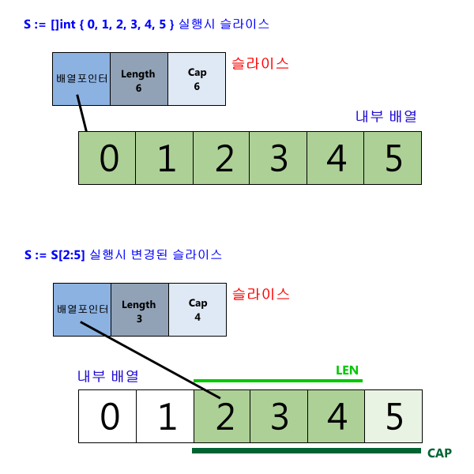

#### 1. 슬라이스(Slice)
- Go 배열 : 고정된 배열크기 안에 동일한 타입의 데이터를 연속적으로 저장
- 배열의 크기를 동적으로 증가시키거나 부분 배열을 발췌하는 기능을 가지고 있지 않음
- Go Slice : 내부적으로 배열에 기초해 만들어졌지만, 배열의 이런 제약점들을 넘어 개발자에게 편리하고 유용한 기능들을 제공함
- 슬라이스는 배열과 달리 고정된 크기를 미리 지정하지 않을 수 있음
    - 차후 그 크기를 동적으로 변경 가능
    - 부분 배열 발췌 가능

- Go Slice 선언 : 배열을 선언하듯이 "var v[]T" 처럼 함
- 배열과 달리 크기는 지정하지 않음
- 정수형 Slice 변수 a를 선언하기 위해, `var a []int` 처럼 선언 가능
``` go
package main
import "fmt"

func main() {
    var a []int        // 슬라이스 변수 선언
    a = []int{1, 2, 3} // 슬라이스에 리터럴값 지정
    a[1] = 10
    fmt.Println(a)     // [1, 2, 3] 출력
}
```

- Go에서 Slice를 생성하는 또 다른 방법 : Go의 내장함수 make() 함수 이용하기
- make() 함수로 슬라이스를 지정하면, 개발자가 슬라이스의 길이(Length)와 용량(Capacity)를 임의로 지정 가능
- `make(슬라이스 타입, 슬라이스의 길이, 내부 배열의 최대 길이)`
    - 모든 요소가 Zero value인 슬라이스를 만들게 됨
    - 세번째 Capacity 파라미터를 생략하면, Capacity는 Length와 같은 값을 가짐
    - 슬라이스의 길이 및 용량은 내장함수 len(), cap()을 써서 확인 가능
``` go
func main() {
    s:= make([]int, 5, 10)
    println(len(s), cap(s))
}
```

- 슬라이스에 별도의 길이와 용량을 지정하지 않으면?
    - 기본적으로 길이, 용량이 0인 슬라이스를 만듦
    - 이를 Nil Slice라 함
    - Nil과 비교하면 참을 리턴
``` go
func main() {
    vars []int

    if s == nil {
        println("Nil Slice")
    }
    println(len(s), cap(s)) // 모두 0
}
```

#### 2. 부분 슬라이스(Sub-slice)
- 슬라이스에서 일부를 발췌해 부분 슬라이스를 만들 수 있음
- 부분 슬라이스 : "슬라이스[처음인덱스:마지막인덱스]" 형식으로 만듦  
ex) 인덱스 2 ~ 4의 데이터를 갖는 부분 슬라이스 : s[2:5]
- 마지막 인덱스 : 원하는 인덱스 + 1 (파이썬과 동일)
``` go
package main
import "fmt"

func main() {
    s := []int {0, 1, 2, 3, 4, 5}
    s = s[2:5]
    fmt.Println(s) // 2, 3, 4 출력
}
```

- 슬라이스 인덱스는 처음/마지막 둘 중 하나 혹은 둘 다 생략 가능
- 처음 인덱스가 생략되면 0이, 마지막 인덱스가 생략되면 그 슬라이스의 마지막 인덱스가 자동 대입됨  
ex1) 처음 ~ 4 : [:5]  
ex2) 2 ~ 마지막 : [2:]  
ex3) 전체 : [:]
``` go
s := []int{0, 1, 2, 3, 4, 5}
s = s[2:5] // 2, 3, 4
s = s[1:] // 3, 4
fmt.Println(s) // 3, 4 출력
```

#### 3. 슬라이스 추가, 병합(append)와 복사(copy)
- 배열은 고정된 크기로 그 크기 이상의 데이터를 임의로 추가할 수 없음
- 슬라이스는 가능
    - append()를 사용
``` go
func main() {
    s := []int{0, 1}

    // 하나 확장
    s = append(s, 2) // 0, 1, 2
    // 복수 요소들 확장
    s = append(s, 3, 4, 5) // 0, 1, 2, 3, 4, 5

    fmt.Println(s)
}
```
- 내장함수 append()가 슬라이스에 데이터를 추가할 때, 내부적으로 다음과 같은 일이 일어남
- 슬라이스 용량(capacity)이 아직 남아 있는 경우 : 그 용량 내에서 슬라이스의 길이(length)를 변경하여 데이터를 추가
- 용량(capacity)을 초과하는 경우, 현재 용량의 2배에 해당하는 새로운 Underlying array(아래 내부구조 참조)을 생성하고 기존 배열 값들을 모두 새 배열에 복제한 후 다시 슬라이스를 할당
``` go
package main

import "fmt"

func main() {
    // len = 0, cap = 3 인 슬라이스
    sliceA := make([]int, 0, 3)

    // 계속 한 요소씩 추가
    for i := 1; i <= 15; i++ {
        sliceA = append(sliceA, i)
        // 슬라이스 길이와 용량 확인
        fmt.Println(len(sliceA), cap(sliceA))
    }
    fmt.Println(sliceA) // 1부터 15까지 숫자 출력
}
```
- 1 ~ 3 : 기존 용량 3 사용
- 4 ~ 6 : 용량 6
- 7 ~ 12 : 용량 12
- 13 ~ 15 : 용량 24

- 한 슬라이스를 다른 슬라이스 뒤에 병합하기 위해서는 아래 예제와 같이 append()를 사용
- 이 append 함수에서는 2개의 슬라이스를 파라미터로 갖는데, 처음 슬라이스 뒤에 두 번째 파라미터의 슬라이스를 추가하게 됨
- 주의점 : 두번째 슬라이스 뒤에 ...을 붙임
    - 이 ellipsis(...)는 해당 슬라이스의 컬렉션을 표현하는 것
    - 두 번쨰 슬라이스의 모든 요소들의 집합을 나타냄
    - sliceB... : 4, 5, 6으로 치환됨
``` go
package main

import "fmt"

func main() {
    sliceA := []int{1, 2, 3}
    sliceB := []int{4, 5, 6}

    sliceA = append(sliceA, sliceB...)
    // sliceA = append(sliceA, 4, 5, 6)

    fmt.Println(sliceA) // [1 2 3 4 5 6] 출력
}
```

- Go 슬라이스는 내장함수 copy()를 사용해 한 슬라이스를 다른 슬라이스로 복사 가능
``` go
func main() {
    source := []int{0, 1, 2}
    target := make([]int, len(source), cap(source) * 2)
    copy(target, source)
    fmt.Println(target)
    println(len(target), cap(target))
}
```

#### 5. 슬라이스의 내부구조
- 슬라이스는 내부적으로 사용하는 배열의 부분 영역인 세그먼트에 대한 메타 정보를 가지고 있음
- 크게 3개의 필드로 구성되어 있음  
    i. 내부적으로 사용하는 배열에 대한 포인터 정보  
    ii. 세그먼트의 길이  
    iii. 세그먼트의 최대 용량(Capacity)
- 처음 슬라이스가 생성될 때, 만약 길이와 용량이 지정되었다면, 내부적으로 용량(Capacity)만큼의 배열을 생성
- 슬라이스 첫번째 필드에 그 배열의 처음 메모리 위치를 지정
- 두번째 길이 필드 : 지정된 길이를 갖게 됨
- 세번째 용량 필드 : 전체 배열의 크기를 가짐

- sub-slice를 하게 되면, 필드가 어떻게 변경되는지 확인 가능